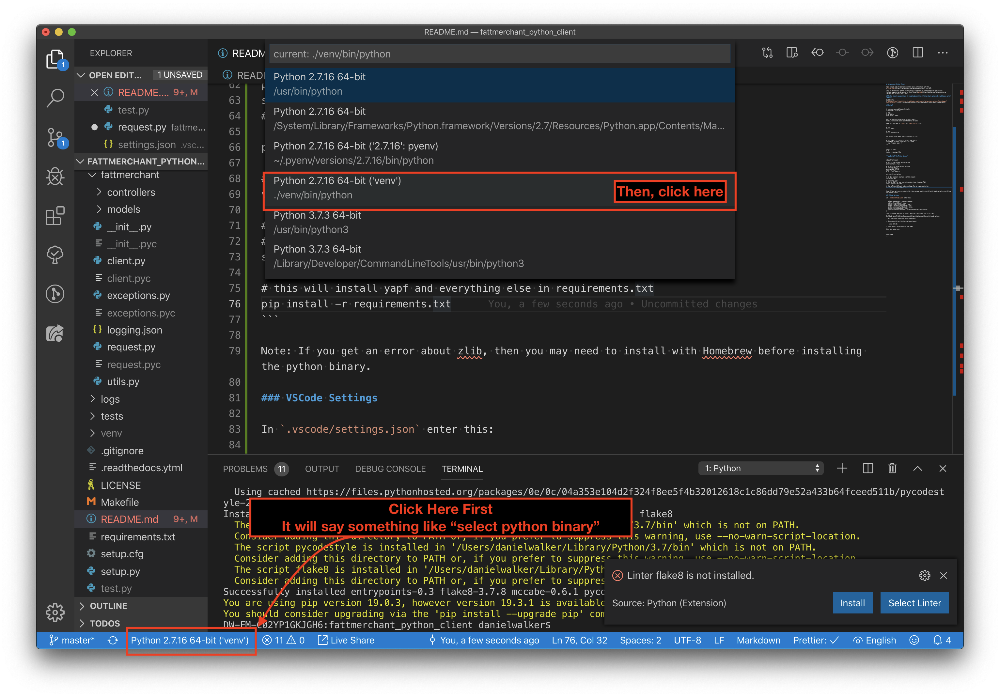

# Fattmerchant Python Client

This package aims to provide assitance while interacting with the
[Fattmerchant](https://fattmerchant.com/api-documentation/) rest API.

This is the official python client which is supported by fattmerchant and bugs/issues/feature-requests can be posted on the official [github](https://github.com/fattmerchantorg/fattmerchant_python_client) page.

## Python client documentation at [readthedocs](https://fattmerchant-python-sdk.readthedocs.io/en/latest/)

build status
[](https://fattmerchant-python-client.readthedocs.io/en/latest/?badge=latest)

## Install

```
# pre-req, you need Xcode cli tools:
xcode-select --install

# THEN:
brew update
brew install pyenv
```

Now, follow this guide to set up your \$PATH.
https://github.com/pyenv/pyenv#homebrew-on-macos

Make sure you have a `.zshrc` OR `.bash_profile` file:

```
# zsh
vim ~/.zshrc

# bash
vim ~/.bash_profile
```

For either Zsh or Bash, paste into your rc file:

```
# Init Pyenv (if it exists) for all new shells
if command -v pyenv 1>/dev/null 2>&1; then
  eval "$(pyenv init -)"
fi
```

```
source ~/.zshrc
# OR
source ~/.bash_profile
```

**Now Install The Python Binary**

```
cd path/to/project

# this is the current version we use
pyenv install 2.7.16

# so far it's installed but not used
# use it globally
pyenv global 2.7.16
source ~/.zshrc
# or ~/.bash_profile

pip install virtualenv

# do this anywhere you have a python project
virtualenv venv

# source the venv
# this is ONLY for your current session, (your terminal Tab)
source venv/bin/activate

# this will install yapf and everything else in requirements.txt
pip install -r requirements.txt
```

_Note: If you get an error about zlib, then you may need to install with Homebrew before installing the python binary._

**When done using venv**

```
# within your venv session...
deactivate
```

### VSCode Settings

In VScode install [Python Extensions](https://github.com/Microsoft/vscode-python)

In `.vscode/settings.json` enter this:

```
{
  "python.pythonPath": "venv/bin/python",
  "editor.formatOnSave": true,
  "python.formatting.provider": "yapf",
  "python.linting.flake8Enabled": true,
  "python.linting.pylintEnabled": false,
  "python.linting.enabled": true,
  "restructuredtext.confPath": "${workspaceFolder}/docs/source"
}
```

Then, if VSCode asks you to install anything like flake8 just click "yes".

Then, Select the Python binary as `venv` in VSCode:



## Test The Util

Make a new file like:

`code test.py`

```
// test.py

from fattmerchant.client import FMClient

fatt = FMClient(
    "API_KEY_HERE",
    "local"
)

transactions = fatt.transactions.list({ "page": 1 })

transaction = fatt.transactions.get(transactions[0].id)

print repr(transaction)

```

**Then run**

```
python test.py
```

## Release to PyPi

Increment version number in these files:

- ./setup.py
- ./docs/source/conf.py

```
source venv/bin/activate

# this will install yapf and everything else in requirements.txt
pip install -r requirements.txt

make upload
```

If you get an auth error, before you fix your password and try again, clear the `dist` folder: `rm -f dist/*.gz && rm -f dist/*.whl`

The project is released here: https://pypi.org/project/fattmerchant/
